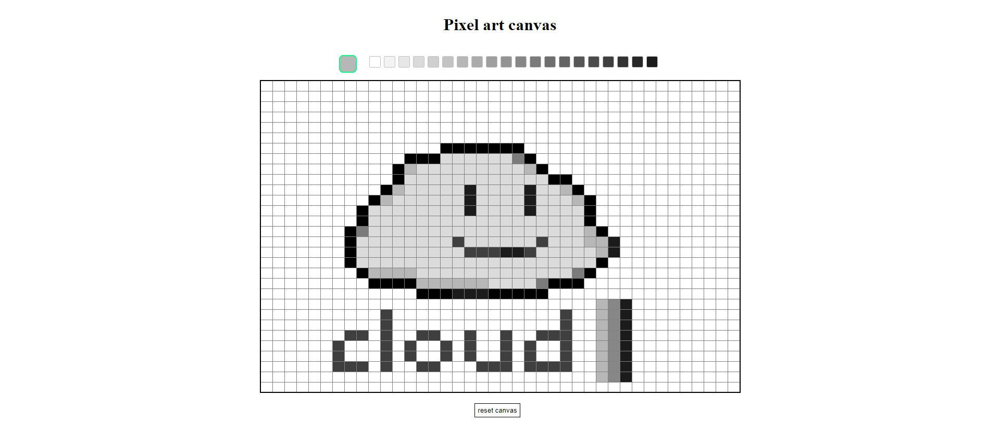
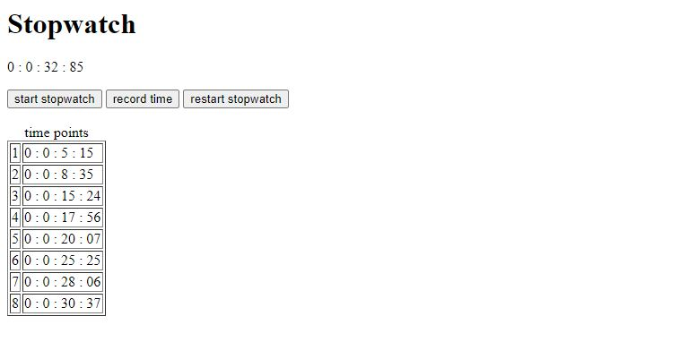
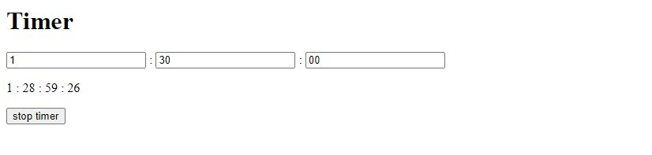
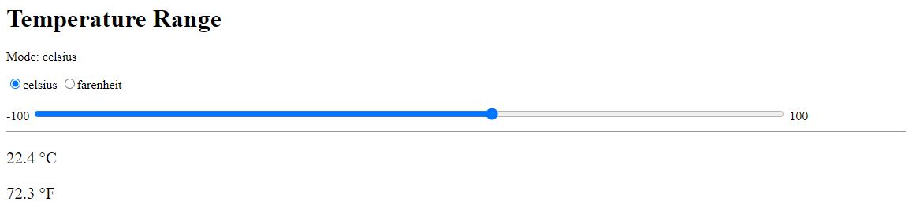

This repo contains sample javascript from (https://fbacarisas.xyz/programming/) as well as prototyped applets

Scripts are primarily minimal, but for additional styling, the CSS can be referenced from [the website's programming.css file](https://fbacarisas.xyz/programming/programming.css)

# Javascript code samples

_____

## [pixel_art_canvas](./pixel_art_canvas)

basic interface to design pixel art

_____

## [stopwatch](./stopwatch)

minimal stopwatch applet

_____

## [timer](./timer)

minimal timer applet

_____

## [temperature_range](./temp_range)

specify temperature at either Celsius or Farenheit across a range of configurable values and get the corresponding temperature value

